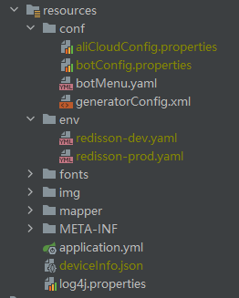
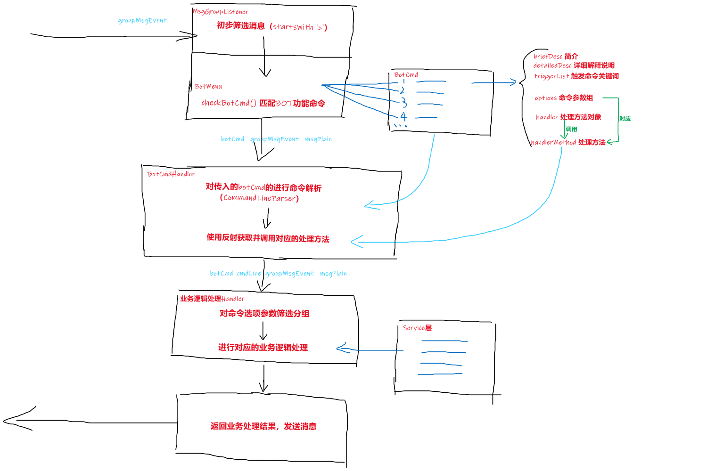

# QQ Robot

当前QQRobot版本：[查看pom.xml文件version标签](./pom.xml#L13)

依赖mirai版本：2.10.0

## 1. 项目主要目录结构

```text
\--qqrobot                             项目根目录
   \--src
      |--main                            主项目文件包
      |  |--java
      |  |  \--cn
      |  |     \--ultronxr
      |  |        \--qqrobot                 QQ机器人代码包
      |  |           |--annotation             自定义注解包
      |  |           |--aspect                 AOP切面定义与advice内容包
      |  |           |--bean                   通用数据对象bean包
      |  |           |  \--mybatis               Mybatis数据库表映射对象包
      |  |           |     |--bean                 数据库表映射bean
      |  |           |     \--mapper               数据库表映射mapper
      |  |           |--config                 项目配置包
      |  |           |--eventHandler           机器人事件处理器接口包
      |  |           |  \--eventHandlerImpl      机器人事件处理器接口实现包
      |  |           |--listener               机器人事件监听器包
      |  |           |--service                具体逻辑处理代码接口包
      |  |           |  \--serviceImpl           具体逻辑处理代码接口实现包
      |  |           \--util                   公共方法类包
      |  \--resources                      项目资源文件包
      |     |--conf                          通用配置文件资源
      |     |--env                           环境配置相关文件资源
      |     |--fonts                         字体文件资源
      |     |--img                           图像文件资源
      |     \--mapper                        数据库表映射mapper.xml
      \--test                            项目测试包
```

## 2. 框架

使用开源框架 [mirai](https://github.com/mamoe/mirai) ，其开发文档见 [mirai开发文档](https://github.com/mamoe/mirai/blob/dev/docs/README.md) ，其Java API文档见 [Mirai - Core API](https://github.com/mamoe/mirai/blob/dev/docs/CoreAPI.md) 。

这里是对mirai的功能应用。

## 3. 依赖

旧版本使用手动安装jar包进行依赖；

更新 `mirai 2.3.2` 版本时变更为使用maven依赖构建，方法见 [在JVM项目中使用mirai](https://github.com/mamoe/mirai/blob/dev/docs/ConfiguringProjects.md) 。

mirai版本规范见此 [链接](https://github.com/mamoe/mirai/blob/dev/docs/Evolution.md#%E7%89%88%E6%9C%AC%E8%A7%84%E8%8C%83) 。


## 4. gitignore的配置文件

`resources` 包内部分配置文件涉及敏感信息（如账号密码、数据库URL等），添加了gitignore未上传至Git。

这里解释它们的用途及配置格式。



### 4.1 conf/aliCloudConfig.properties

有关阿里云账号的配置文件。

```properties
# 阿里云天气接口appKey
ali.weatherAPI.app.key=
ali.weatherAPI.app.secret=
ali.weatherAPI.app.code=

# 阿里云OSS子用户（OSSUserTwo）
ali.subUser.accessKey.id=
ali.subUser.accessKey.secret=

# 阿里云OSS配置
ali.oss.endPoint=
ali.oss.bucketName=
ali.oss.folderKey=
```

### 4.2 conf/botConfig.properties

QQ机器人账号配置文件。

```properties
# bot账号信息
bot.qq=
bot.pwd=
bot.nick=

# 日志记录路径和文件
bot.log.path.bot=logs/bot
bot.log.path.network=logs/network
bot.log.file.bot=
bot.log.file.network=
```

### 4.3 env/redisson-dev.yaml 与 env/redisson-prod.yaml

Redisson配置文件，分为开发环境与生产环境两份。

```properties
# 单节点配置
singleServerConfig:
  # 空闲等待超时（毫秒）
  idleConnectionTimeout: 10000
  # 连接等待超时（毫秒）
  connectTimeout: 10000
  # 命令等待超时（毫秒）
  timeout: 3000
  # 命令执行失败重试次数
  retryAttempts: 3
  # 命令重试时间间隔（毫秒）
  retryInterval: 1500
  # 客户端名称、地址、密码
  clientName: null
  address: 
  password: 
  # 单个连接最大订阅数量
  subscriptionsPerConnection: 5
  # 发布和订阅最小空闲连接数量
  subscriptionConnectionMinimumIdleSize: 1
  # 发布和订阅连接池大小
  subscriptionConnectionPoolSize: 50
  # 最小连接空闲数量
  connectionMinimumIdleSize: 24
  # 连接池大小
  connectionPoolSize: 64
  # 数据库编号
  database: 0
  # DNS监测时间间隔（毫秒）
  dnsMonitoringInterval: 5000
# 线程池线程数量，默认值：CPU核心数*2
threads: 4
# netty线程池线程数量，默认值：CPU核心数*2
nettyThreads: 4
# 编码
codec: !<org.redisson.codec.MarshallingCodec> {}
# 传输模式
transportMode: "NIO"
```

### 4.4 deviceInfo.json

mirai登录QQ账号时产生的设备信息记录文件。


## 5. `deviceInfo.json`设备信息文件路径问题

有关`deviceInfo.json`设备信息文件说明请查阅 [官方说明](https://github.com/mamoe/mirai/blob/dev/docs/Bots.md#%E8%AE%BE%E5%A4%87%E4%BF%A1%E6%81%AF) 。

在线生成`deviceInfo.json`文件 [链接](https://ryoii.github.io/mirai-devicejs-generator/) 。

初始化QQ机器人的库函数只接收 `deviceInfo.json` 的字符串路径，在IDE中未打jar包时可以使用如下路径，编译运行正常：

```text
src\main\resources\deviceInfo.json
```

但maven package打包成jar包再运行会报错提示找不到该文件，因为jar包中的文件路径是：

```text
qqrobot.jar!/BOOT-INF/classes!/deviceInfo.json
```

且使用如下代码也无效：

```java
BotEntity.class.getResource("/deviceInfo.json").getPath();
BotEntity.class.getResourceAsStream("/deviceInfo.json");
```


为了解决这个问题，这里采用了如下方式（**是否可以更完善**）：

检测当前是否在jar包中运行，

+ 如果不在jar包中运行，则直接使用*classpath*中的`deviceInfo.json`文件路径。

+ 如果在jar包中运行，则不使用jar包*classpath*中的`deviceInfo.json`文件路径，改成jar包所处路径（由jar包内路径改成jar包外路径），当然 **这需要在jar包所处路径手动放置deviceInfo.json文件** 。

## 6. 事件通道（EventChannel）和事件（Event）监听注册

[事件通道](https://github.com/mamoe/mirai/blob/dev/docs/Events.md#%E4%BA%8B%E4%BB%B6%E9%80%9A%E9%81%93) 介绍

支持的所有 [事件列表](https://github.com/mamoe/mirai/blob/dev/mirai-core-api/src/commonMain/kotlin/event/events/README.md)

+ 机器人事件通道的获取、所有事件的监听（Listener）注册只在 [`cn.ultronxr.qqrobot.listener.AllListenerRegister`](src/main/java/cn/ultronxr/qqrobot/listener/AllListenerRegister.java) 文件内进行；

+ [`cn.ultronxr.qqrobot.listener`](src/main/java/cn/ultronxr/qqrobot/listener) 包内的其他Listener用于预处理内容/逻辑繁复的事件，辅助 `AllListenerRegister` 进行事件注册；

+ [`cn.ultronxr.qqrobot.eventHandler`](src/main/java/cn/ultronxr/qqrobot/eventHandler) 包内包括了所有事件处理器（Handler）接口及其实现方法，被事件监听器调用；

+ 上述 `listener` 和 `eventHandler` 包内文件的命名遵循事件分类易读的原则，以 **Bot** 命名开头的文件中的方法都是与 `BOT事件` 相关的；以 **Msg** 命名开头的文件中的方法都是与 `消息事件` 相关的；以 **Group** 命名开头的文件中的方法都是与 `群事件` 相关的；等等；

## 7. 命令化的消息语句格式

此QQRobot与QQ消息内容的交互采用 `命令化的消息语句格式` 。

使用 命令化的消息语句格式 的消息语句包含如下内容：

1. 命令前导符，即“>”符号，指明这是一条功能命令消息语句。
2. 命令关键词，即命令名称，由此确认这条语句是什么功能命令。
3. 命令选项，使用命令选项会将功能命令导向不同的逻辑处理分支。
4. 命令选项参数，向命令选项输入参数内容。

例如我需要QQRobot发送一个 **包含若干空行的清屏（刷屏）消息** ，那么你可以发送以下消息中的任意一行：

```text
>clear
>clear 25
>clear -l 25
>clear --line 25
>clear --line=25

注：
上述消息中；“>”为命令前导符；“clear”为命令关键词；“-l” “--line”为命令选项；“25” “=25”为命令选项参数。
```

如果我需要让QQRobot发送有关这条命令的帮助信息，那么你可以发送以下消息：

```text
>clear --help

请注意：
使用如下消息无法让你获取正确的命令帮助信息，因为帮助信息只能使用--help命令选项获取，命令选项-h保留给其他用途。
>clear -h
```

为了实现上述功能，在此引入下面一节内容：[BotCmd与BotMenu架构](#7-botcmd-与-botmenu-架构)

## 8. `BotCmd` 与 `BotMenu` 架构

`BotCmd` 是对BOT功能命令的封装，一个BotCmd代表一个业务功能命令，所有BotCmd组合成 `BotMenu` ，即BOT功能菜单，统一管理业务功能。

（下图是白板鼠标画的，很粗糙，后续可能会重绘一下）



## 9. 项目代码中使用 `BotCmd` 与 `BotMenu` 架构

1. 在 [botMenu.yaml](src/main/resources/conf/botMenu.yaml) 配置文件中配置功能命令和命令选项；
2. 在 [eventHandler包](src/main/java/cn/ultronxr/qqrobot/eventHandler) 添加事件处理器（Handler）代码；
3. 在 [service包](src/main/java/cn/ultronxr/qqrobot/service) 添加业务逻辑处理（Service）代码；
4. 在 [BotMenuConfig.java](src/main/java/cn/ultronxr/qqrobot/config/BotMenuConfig.java) 文件中注入（@Autowired）handler对象。

注：

+ 有关botMenu.yaml配置文件的配置格式，请查看该文件内开头的注释内容，解释了各个配置项的含义和要求；
+ 命令筛查步骤代码请查看 [MsgGroupListener.java](src/main/java/cn/ultronxr/qqrobot/listener/MsgGroupListener.java) ；
+ 命令解析步骤代码请查看 [BotCmdHandler.java](src/main/java/cn/ultronxr/qqrobot/eventHandler/BotCmdHandler.java) ；
+ 涉及到事件监听器和事件处理器的内容，请参见本文前面的 [事件通道（EventChannel）和事件（Event）监听注册](#5-事件通道eventchannel和事件event监听注册) 。

## 10. 登录验证（滑块验证）

有时QQ登录时需要进行登录验证，在使用 `MiraiProtocol.ANDROID_PHONE` 协议情况下，一般会提示使用滑块验证。

滑块验证打印日志打印样例如下：

```log
2021-10-19 16:08:11 I/Net xx: [SliderCaptcha] 需要滑动验证码, 请按照以下链接的步骤完成滑动验证码, 然后输入获取到的 ticket
2021-10-19 16:08:11 I/Net xx: [SliderCaptcha] Slider captcha required. Please solve the captcha with following link. Type ticket here after completion.
2021-10-19 16:08:11 I/Net xx: [SliderCaptcha] @see https://github.com/project-mirai/mirai-login-solver-selenium
2021-10-19 16:08:11 I/Net xx: [SliderCaptcha] @see https://docs.mirai.mamoe.net/mirai-login-solver-selenium
2021-10-19 16:08:11 I/Net xx: [SliderCaptcha] 或者输入 TxCaptchaHelper 来使用 TxCaptchaHelper 完成滑动验证码
2021-10-19 16:08:11 I/Net xx: [SliderCaptcha] Or type `TxCaptchaHelper` to resolve slider captcha with TxCaptchaHelper.apk
2021-10-19 16:08:11 I/Net xx: [SliderCaptcha] Captcha link: https://ssl.captcha.qq.com/template/wireless_mqq_captcha.html?style=simple&aid=xx&uin=xx&sid=xx&cap_cd=xx&clientype=1&apptype=2
```

这里我推荐使用 [`TxCaptchaHelper.apk`](https://github.com/mzdluo123/TxCaptchaHelper/releases) 进行滑块验证，事先在手机上安装这个APP，然后使用以下任一步骤进行验证：

+ 在终端窗口中输入 `TxCaptchaHelper` 回车确认，会生成一个请求码，在APP中输入请求码之后返回ticket，再在终端中输入ticket回车确认；
+ 直接把日志打印的Captcha link验证链接复制到APP中输入，同样会返回ticket，在终端中输入ticket回车确认。

